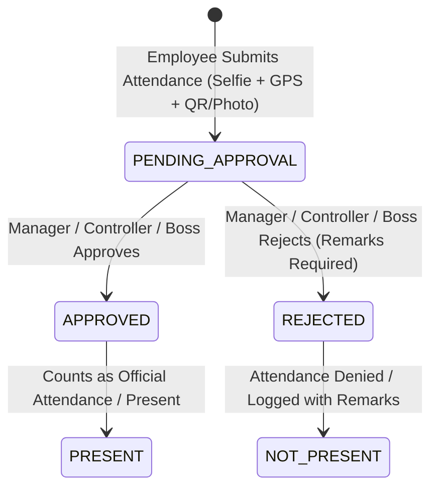

# SAFE SOLUTIONS — FLEET & SMART ATTENDANCE SYSTEM
## Business Rules Specification

### 1. Attendance Workflow & State Machine

#### Inviolable Business Rules:
1. **Submission $\neq$ Present**: When an employee submits attendance, its status is strictly `PENDING_APPROVAL`. It CANNOT be counted as `PRESENT` until approved by an authorized Manager, Controller, or Boss.
2. **No Self-Approval**: An employee can NEVER approve, reject, or alter their own attendance record or approval status.
3. **Immutable Timestamps**: When an attendance request is edited or reviewed, `original_check_in_time` and `original_check_out_time` are NEVER overwritten. All edits store `edited_by`, `edit_reason`, and edit timestamps in audit logs.
4. **Duplicate Submission Protection**: The backend enforces idempotency keys and checks for existing check-ins on the same date for the same employee to prevent accidental multi-submissions.

---

### 2. Fleet & Vehicle Workflows
1. **Adaptive Vehicle Architecture**:
   - **Bike Employees**: Vehicle QR scan, live selfie, live odometer photo & OCR, fuel claims, and mileage tracking.
   - **Car Employees**: Same complete vehicle workflows with car vehicle classification.
   - **No-Vehicle Employees** (e.g. Samaira Mubashar & M. Husnain Farooq): Dedicated Office & Site attendance without forced vehicle prompts or mandatory QR scans.
2. **Vehicle Assignment History**:
   - Vehicle assignments are stored in `VehicleAssignment` records (`assigned_at`, `unassigned_at`, `assigned_by`, `status`, `notes`).
   - Assignment history is NEVER deleted or overwritten when a vehicle is reassigned or returned.
3. **Odometer Monotonicity**:
   - New odometer readings must normally be $\ge$ previous accepted odometer reading.
   - If a lower reading is submitted, the system flags the record as an exception and mandates Controller/Manager review.
4. **Mileage & Consumption Calculation**:
   - $\text{Distance Traveled} = \text{Current Odometer} - \text{Previous Accepted Odometer}$.
   - $\text{Fuel Efficiency (KM/L)} = \frac{\text{Distance Traveled (KM)}}{\text{Liters Fueled}}$.
   - $\text{Cost per KM} = \frac{\text{Fuel Cost (PKR)}}{\text{Distance Traveled (KM)}}$.

---

### 3. Geofencing & Evidence Rules
1. **Office Attendance**:
   - Requires scanning valid Office QR code.
   - Server calculates distance via Haversine formula from configured Office GPS coordinates.
   - If employee is outside `allowed_radius_meters`, the submission is flagged with `is_geofence_violation = true` and distance recorded for manager review.
2. **Site Attendance**:
   - Does NOT require Site QR code.
   - Requires site selection from registry, GPS coordinate capture, live selfie, and site workplace photo.
3. **Live Camera & Anti-Spoofing**:
   - Front camera live selfie required for all attendance flows.
   - Direct file picker / gallery uploads are blocked on the mobile client.
